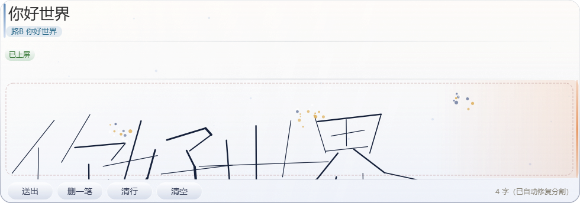

# hwime — 悬浮手写输入法

[](https://www.python.org/)
[](https://doc.qt.io/qtforpython-6/)
[](https://github.com/PaddlePaddle/PaddleOCR)
[](LICENSE)

在悬浮面板上像写字一样连续书写中文，识别出的规范文字自动打进当前焦点窗口。
桌面常驻悬浮球一键开合；单行大格书写区带**笔锋渲染**与**笔尖预测**；
毛玻璃 / 渐变 / 圆角 / 粒子特效 UI；双路识别（路 B 整行 OCR 主导上屏 +
路 A 笔迹 CNN 供纠正菜单）。



## 安装（推荐）

```
双击 installer\install.bat        （或 pythonw installer\installer.pyw）
```

图形化安装向导：选择安装位置 → 自动复制完整运行时（约 1.6GB，含
Python 本体，**目标机无需装任何依赖**）→ 创建桌面/开始菜单快捷方式 →
写入卸载注册表项 → 可选开机自启。安装完成后从快捷方式即可使用；
控制面板「应用和功能」里可正常卸载（附开始菜单卸载快捷方式）。

安装版行为：**系统托盘常驻**（显示/隐藏面板、设置、开机自启、关于、退出），
`--boot` 自启动模式静默进托盘。

## 启动（开发）

```
python panel\main.py
```

首次加载识别引擎约 5 秒。窗口出现在屏幕右下角；系统托盘出现「手」图标。

> 本机（C:/WBproject）专用环境：venv 位于
> `C:\Users\lab\.workbuddy\binaries\python\envs\hwime`，用其中的
> `Scripts\python.exe` 启动（已装 torch/rapidocr/PySide6 等全部依赖）。

## 设置

托盘菜单 →「设置…」：书写手感（基础线宽 / 速度调制 / 起笔轻入 / 行笔鼓肚 /
收笔出锋 / 笔尖预测）、视觉（毛玻璃霜化 / 环境粒子 / 面板不透明度 /
实时毛玻璃开关）。改动「应用」后立即生效，保存在 `data/settings.json`。

## 用法

桌面常驻一个圆形**悬浮球**（可拖到任意位置，位置自动记忆）：点击它弹出
输入法面板，再点收起。窗口出现在悬浮球上方。

| 操作 | 方式 |
|---|---|
| 开/关面板 | 点击悬浮球（或热键 Ctrl+Alt+H，被占用依次回退 K/G/F9/F10） |
| 书写 | 在单行大格手写区用数位板/鼠标从左到右写，可连续写多字（带笔锋渲染 + 笔尖预测） |
| 预识别 | 一笔结束后停顿约 0.6 秒，候选条显示识别结果（不上屏） |
| 纠正 | 双击候选条上某个字，弹出备选菜单点选 |
| 上屏 | 点「送出」，或写到手写行最右端停顿 1.2 秒自动送出（行清空继续写） |
| 回显 | 上屏后的字迹缩略图留在「已上屏」回显行 |
| 删除 | 「删一笔」撤最后一笔；「清行」清空当前行；「清空」全清 |
| 移动面板 | 拖动候选条或回显行区域 |
| 透明度 | 鼠标滚轮 |

文字通过 SendInput 以 Unicode 逐字符打进当前焦点窗口——先把光标点进目标
输入框，再写。对管理员权限窗口（UIPI）无法注入，属 Windows 限制。

## 架构

```
panel/main.py     PySide6 悬浮面板（不夺焦、置顶、半透明）
engine/hwengine/
  ink.py          笔迹数据结构 + 墨迹渲染
  segment.py      连续书写笔迹的单字分割（水平投影空隙 + 时序停顿）
  route_a.py      路 A：在线笔迹 CNN（cnn_chinese_hw 预训权重，CPU）
  route_b.py      路 B：整行墨迹渲染成图 → PP-OCRv6 rec（跳过检测器）
  fuse.py         旧双路融合（逐位融合/词频 beam）——仅保留给评测对照
  pipeline.py     分割 → 路 B 整行 → 长度修复（DP 按字数重切）→ 路 A 逐块
  paths.py        项目根/上游参考仓库定位（HWIME_REF 可覆盖）
```

**上屏文本以路 B 为准，路 A 只作为「双击候选条」纠正菜单的备选来源。**

这是真实笔迹数据验证后的结论（engine/eval_captures.py）：用户实写分布下
路 B 全线优于路 A（路 A 风格失配、置信度普遍 ≤0.5）；旧版"逐位融合"在
任何权重下都会把本该正确的路 B 结果拖坏（曾把"你好"融合成"们牡"）。
合成评测里路 A 看似 85%+，是因为合成笔迹取自路 A 训练语料本身（训练集
内评测，虚高）。

## 测试

```
python engine\test_route_a.py        # 路 A 单字冒烟
python engine\eval_m0.py             # 合成句子评测（训练分布，路 A 虚高）
python engine\eval_captures.py       # 真实笔迹离线评测（captures.jsonl）
python panel\test_send_input.py      # SendInput 上屏链路（--live 真机注入）
python panel\test_hotkey.py          # 全局热键链路（合成 Ctrl+Alt+H 真机验证）
python panel\smoke_test.py           # 面板离屏全链路（SendInput 打桩）
```

合成评测（SEED=42，5-9 字随机句，整句/单字）：
现行(路B主导) 50%/84.6%，纯路A 85%/88.8%，旧融合 85%/91.6%
——注意上文的训练集虚高说明，真实分布结论以 eval_captures 为准。

## 依赖

Python 3.13+（本机 venv 为 3.13.12）：PySide6 / onnxruntime / rapidocr /
torch(CPU) / numpy / PIL / jieba；上游参考实现 cnn_chinese_hw 位于工作区
`_ref\cnn_chinese_hw`（以 editable 方式安装，预训权重与 Tomoe/Android
语料一并 clone 在内）。参考仓库位置可用环境变量 `HWIME_REF` 覆盖。

## 已知边界（v1）

- 分割依赖字间隙；字贴着写会被粘连（DP 按字数重切兜底）
- 路 A（笔迹 CNN）对行书/快写风格失配严重（真实数据 top1≈38%、
  top3≈45%）；纠正菜单可救约一半的错字。**正解是个人字库微调**——用
  面板落盘的 captures.jsonl 微调 CNN（上游自带 HandwritingRegister）
- 压感未使用（实测驱动 pressure 恒 ~0.02）；笔画粗细由速度模拟
- SendInput 对管理员窗口无效（UIPI）
